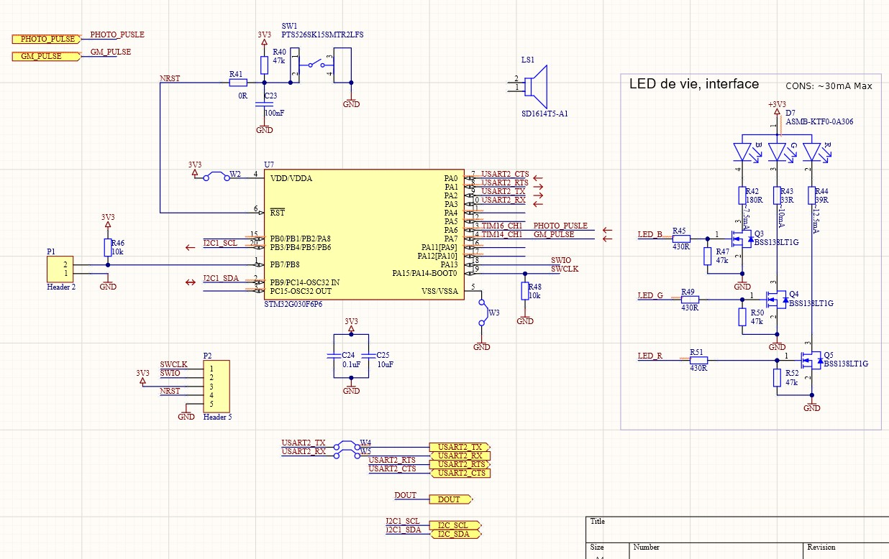
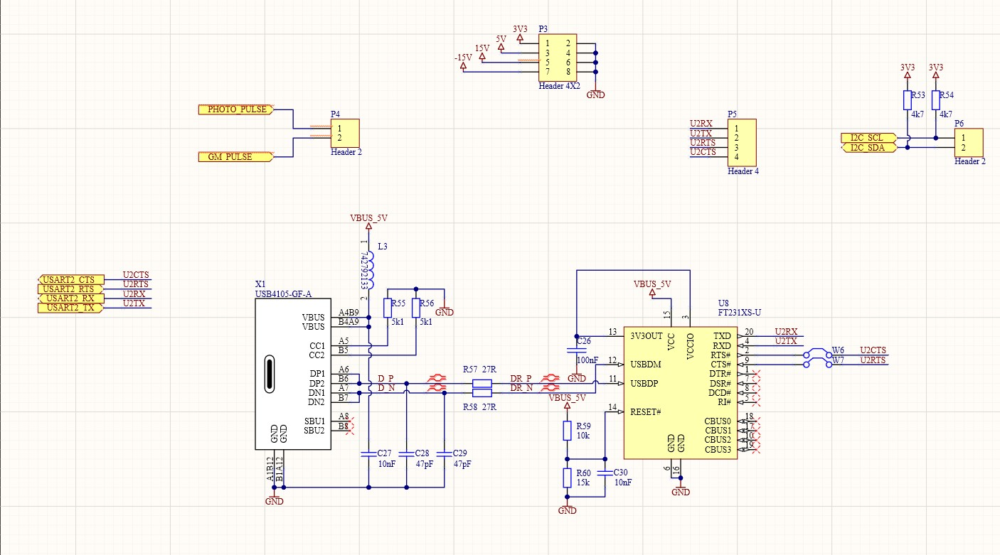
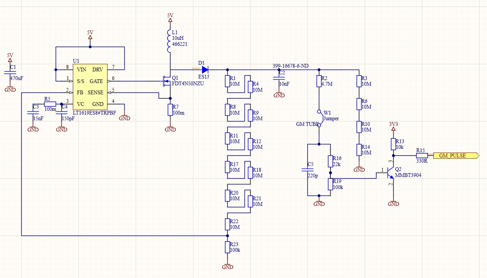
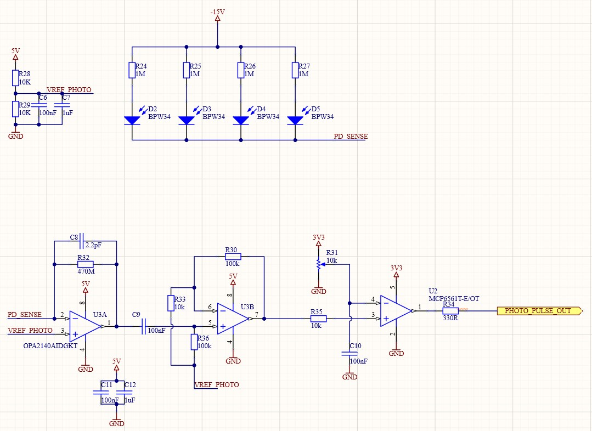

# Radon Sense — Hardware Altium

Radon Sense est un prototype hardware exploratoire développé dans le cadre d’un projet MVP.  
L’objectif est de rendre le risque radon plus visible, compréhensible et actionnable à travers un système de détection basé sur deux voies complémentaires :

- un canal **Geiger-Müller** pour détecter des événements ionisants ;
- un canal **photodiode BPW34** comme voie expérimentale à faible coût ;
- un microcontrôleur **STM32G030** pour compter les impulsions et piloter une interface locale ;
- une interface **USB-C / FTDI / debug** pour faciliter les tests.

> ⚠️ Ce projet est un prototype exploratoire.

---

## Objectif du prototype

Le radon est un gaz radioactif naturel, invisible et inodore, qui peut s’accumuler dans les bâtiments.  
Le but du projet n’est pas seulement de détecter des impulsions, mais de poser les bases d’un système capable de :

1. détecter des événements ionisants ;
2. compter les impulsions localement ;
3. fournir une indication simple à l’utilisateur ;
4. évoluer vers une solution plus complète avec calibration, boîtier et interface logicielle.

---

## Architecture générale

Le hardware est organisé en plusieurs blocs séparés :

```text
Entrée 5 V
   |
   +--> Rail 3.3 V
   |       |
   |       +--> STM32G030
   |       +--> comparateurs
   |       +--> LEDs / buzzer
   |
   +--> Rails +15 V / -15 V
   |       |
   |       +--> canal photodiode BPW34
   |
   +--> Génération haute tension
           |
           +--> tube Geiger-Müller
````

Deux signaux numériques principaux sont générés :

```text
GM_PULSE      -> impulsions issues du tube Geiger-Müller
PHOTO_PULSE   -> impulsions issues du canal photodiode
```

Ces signaux sont ensuite lus par le microcontrôleur.

---

## Blocs du projet

### 1. Microcontrôleur STM32G030

Le bloc MCU repose sur un **STM32G030F6P6**.
Il reçoit les impulsions issues des deux canaux de détection et peut piloter des éléments d’interface locale.

Fonctions principales :

* comptage des impulsions `GM_PULSE` ;
* comptage des impulsions `PHOTO_PULSE` ;
* pilotage d’une LED RGB ;
* pilotage d’un buzzer ;
* exposition de signaux UART, I2C et SWD pour le debug.



---

### 2. Interface USB-C, FTDI et debug

Ce bloc fournit les connecteurs nécessaires pour l’alimentation, la communication et le debug.

Fonctions principales :

* connecteur USB-C ;
* interface USB-UART avec FT231XS ;
* résistances CC pour la détection USB-C ;
* accès UART ;
* connecteur SWD ;
* connecteur I2C ;
* connecteurs d’entrée/sortie pour les impulsions.



---

### 3. Canal Geiger-Müller

Le canal Geiger-Müller est la voie de détection principale du prototype.
Il utilise une alimentation haute tension générée à partir du 5 V pour alimenter un tube GM.

Principe :

1. un convertisseur boost génère une haute tension ;
2. le tube Geiger-Müller est polarisé sous haute tension ;
3. lorsqu’un rayonnement ionisant traverse le tube, le gaz est ionisé ;
4. une avalanche électrique produit une impulsion ;
5. cette impulsion est mise en forme par un transistor ;
6. le signal logique `GM_PULSE` est envoyé au microcontrôleur.

Composants principaux :

* contrôleur boost `LT1619` ;
* MOSFET haute tension `FDT4N50NZU` ;
* diode rapide haute tension `ES1J` ;
* tube Geiger-Müller ;
* transistor de mise en forme `MMBT3904`.



---

### 4. Canal photodiode BPW34

Le canal photodiode est une voie expérimentale complémentaire.
Il utilise plusieurs photodiodes **BPW34** polarisées en inverse afin d’augmenter leur zone sensible.

Principe :

1. les photodiodes sont polarisées en inverse ;
2. une interaction ionisante peut générer une très faible charge ;
3. le signal est converti et amplifié par un étage analogique ;
4. un comparateur transforme le signal en impulsion logique ;
5. le signal `PHOTO_PULSE` est envoyé au microcontrôleur.

Composants principaux :

* 4 photodiodes `BPW34` ;
* amplificateur opérationnel `OPA2140` ;
* réseau de polarisation ;
* étage de gain ;
* comparateur `MCP6561`.

Cette voie est plus sensible au bruit que le canal GM. Elle dépend fortement du routage, du blindage lumineux, de la géométrie du boîtier et de la qualité de l’électronique analogique.



---

## Sorties et signaux importants

| Signal        | Description                                     |
| ------------- | ----------------------------------------------- |
| `GM_PULSE`    | Impulsion numérique issue du tube Geiger-Müller |
| `PHOTO_PULSE` | Impulsion numérique issue du canal photodiode   |
| `USART2_TX`   | Transmission UART                               |
| `USART2_RX`   | Réception UART                                  |
| `I2C_SCL`     | Horloge I2C                                     |
| `I2C_SDA`     | Données I2C                                     |
| `SWCLK`       | Horloge SWD pour debug                          |
| `SWIO`        | Données SWD pour debug                          |

---

## Alimentation

Le projet est alimenté à partir d’une entrée principale de **5 V**.

Les rails utilisés sont :

| Rail             | Utilisation                                              |
| ---------------- | -------------------------------------------------------- |
| `5 V`            | entrée principale, USB-C, alimentation de certains blocs |
| `3.3 V`          | microcontrôleur, comparateurs, logique numérique         |
| `+15 V / -15 V`  | polarisation et analogique photodiode                    |
| haute tension GM | alimentation du tube Geiger-Müller                       |

La séparation des alimentations est volontaire afin de limiter les interactions entre :

* la haute tension ;
* l’analogique sensible ;
* la logique numérique ;
* l’interface USB/debug.

---

## Sécurité

Ce projet contient une section haute tension destinée au tube Geiger-Müller.

Précautions importantes :

* ne pas manipuler la carte sous tension ;
* décharger les condensateurs haute tension avant intervention ;
* respecter les distances d’isolement sur le PCB ;
* éviter les contacts directs avec le bloc haute tension ;
* utiliser des instruments adaptés pour les mesures HV ;
* ne pas considérer le prototype comme un appareil médical ou certifié.

---

## État actuel

Le projet est au stade de conception hardware.

Réalisé :

* architecture générale définie ;
* schémas électroniques des blocs principaux ;
* sélection des composants clés ;
* génération haute tension étudiée ;
* canaux GM et photodiode définis ;
* interface MCU / USB / debug intégrée.

Encore à faire :

* finaliser le routage PCB ;
* fabriquer une première carte ;
* tester les alimentations ;
* valider le canal Geiger-Müller ;
* valider le canal photodiode ;
* calibrer les mesures avec une référence connue ;
* concevoir un boîtier adapté ;
* documenter les résultats expérimentaux.

---

## Limites du prototype

Ce prototype ne mesure pas directement une concentration certifiée en Bq/m³.
Il détecte des événements ou impulsions liés à des rayonnements ionisants, puis permet d’explorer une stratégie de mesure.

Les limites principales sont :

* absence de calibration officielle ;
* absence de comparaison expérimentale avec une référence certifiée ;
* sensibilité du canal photodiode encore incertaine ;
* dépendance forte au boîtier et à la géométrie ;
* absence de tests longue durée ;
* pas encore de PCB fabriqué ni validé.

---

## Vision à long terme

À terme, Radon Sense pourrait évoluer vers un système combinant :

* un capteur hardware fiable ;
* une calibration avec mesures de référence ;
* une interface utilisateur simple ;
* des alertes compréhensibles ;
* des recommandations d’action ;
* un historique des mesures ;
* une aide à la décision pour les particuliers ou bâtiments publics.

L’objectif final serait de ne pas seulement afficher une donnée technique, mais d’aider l’utilisateur à comprendre le niveau de risque et à décider quoi faire.

---

## Auteur

Projet réalisé par :

**Ali Zoubir**

Projet développé dans le cadre du cours MVP.

```
```
